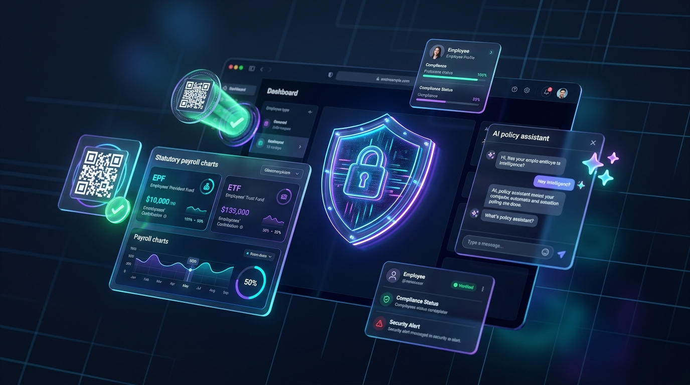
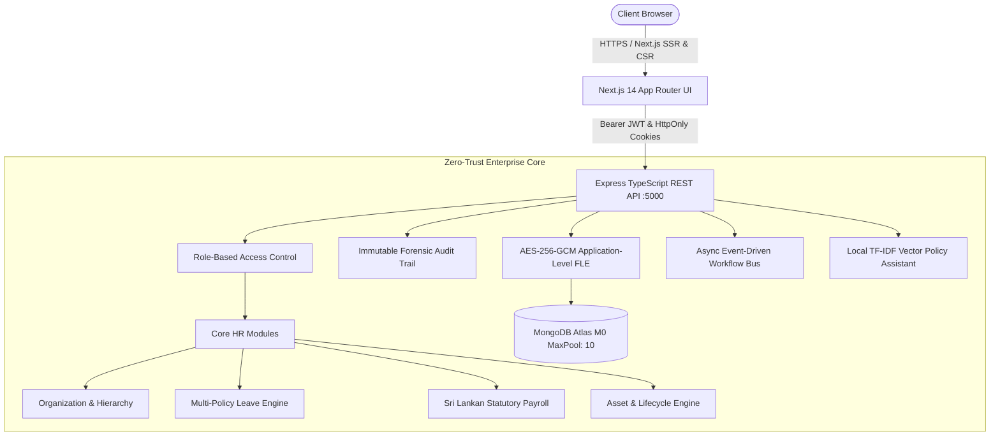

# 🛡️ Enterprise Zero-Trust Employee Management System (HRMS)

<p align="center">
  
</p>

<p align="center">
  <a href="https://github.com/VikumTheekshana/EmployeeManagementSystem"></a>
  <a href="https://nextjs.org/"></a>
  <a href="https://nodejs.org/"></a>
  <a href="https://www.mongodb.com/atlas"></a>
  <a href="https://tailwindcss.com/"></a>
  <a href="https://en.wikipedia.org/wiki/Galois/Counter_Mode"></a>
  
</p>

> A production-grade, enterprise Human Resource Management System (HRMS) built on **Zero-Trust principles**, featuring **Application-Level Field-Level Encryption (AES-256-GCM)**, **Sri Lankan statutory compliance** (EPF, ETF, APIT progressive taxes), **Dynamic Rotating QR Attendance**, **Multi-Gate Offboarding Automations**, and an **Internal AI HR Policy Assistant (RAG Engine)**.

---

## 🏛️ System Architecture



---

## 🚀 Key Engineering Highlights

### 1. Zero-Trust Security & Application-Level FLE (AES-256-GCM)
* **Never Trust, Always Verify:** Sensitive financial and identity fields (`basicSalary`, `bankAccountNumber`, `nationalId`) are encrypted client-side/application-side using **AES-256-GCM** before touching MongoDB Atlas.
* **Database Dump Protection:** Stored database records contain only encrypted ciphertexts formatted as `enc:v1:<12-byte IV>:<16-byte AuthTag>:<Ciphertext>`. Even in the event of an SQL/NoSQL injection or database dump, sensitive fields cannot be deciphered.
* **Dynamic Just-In-Time (JIT) Data Masking:** By default, sensitive numbers are masked (`Rs. •••••••`, `********4455`). Unmasking by authorized administrators triggers an immediate, immutable forensic audit record.

### 2. Sri Lankan Statutory Compliance & Payroll Engine
* **Employees' Provident Fund (EPF):** Complies with EPF Act No. 15 of 1958.
  * Mandatory Employee Deduction: **8%** of total qualifying salary.
  * Mandatory Employer Contribution: **12%** of total qualifying salary.
* **Employees' Trust Fund (ETF):** Complies with ETF Act No. 46 of 1980.
  * Mandatory Employer Contribution: **3%** (non-deductible from gross salary).
* **Advance Personal Income Tax (APIT / PAYE):** Progressive tax bracket evaluation aligned with Inland Revenue Department (IRD) guidelines:
  * 0% up to LKR 100,000 / month.
  * Progressive 6%, 12%, 18%, 24%, 30%, and 36% brackets.
* **Cryptographic PDF Payslip Generation:** Automated generation of formal computer-generated payslips using PDFKit.
* **SLIPS Bank Payment Export:** Direct export in Sri Lanka Interbank Payment System (SLIPS) CSV format for one-click corporate batch bank processing.

### 3. Hybrid Attendance & Anti-Proxy Rotating QR Kiosk
* **Dynamic Rotating QR Codes:** Displays cryptographic HMAC-SHA256 signed QR codes on office kiosks that rotate every 30 seconds. Prevents screenshot forwarding and "buddy punching".
* **Geofence Boundary Verification:** Verifies mobile GPS coordinates against Colombo World Trade Center HQ radius (500m threshold).
* **Biometric Device Webhook:** Ingests automated punches from physical biometric devices (ZKTeco, Hikvision).

### 4. Multi-Gate Offboarding & Gratuity Calculation
* **Event-Driven Workflow Automation:** Resignation events automatically dispatch IT asset recovery tickets, freeze account credentials, and route clearance gates:
  * **IT Gate:** Verifies physical surrender of laptops, displays, and access cards.
  * **Finance Gate:** Computes statutory terminal gratuity under the **Payment of Gratuity Act No. 12 of 1983** (1/2 month's basic salary per completed year of service for employees with 5+ years of continuous service).
  * **HR Exit Gate:** Records exit interviews and automatically releases service letters.

### 5. Internal HR Policy Assistant (RAG Engine)
* **Local TF-IDF Vector Similarity Search:** Indexes company policy documents (`leave-policy.md`, `health-insurance.md`, `payroll-and-taxes.md`, `separation-and-gratuity.md`).
* **Zero Data Leakage:** Synthesizes accurate answers citing specific policy clauses without sending confidential corporate guidelines to external third-party cloud APIs.

---

## 🔑 Pre-Seeded Demo Credentials (Tenant: `apex-ceylon`)

| Role | Email | Password | Access Level |
|---|---|---|---|
| **SuperAdmin (CEO)** | `admin@apexceylon.com` | `Admin@12345` | Full Enterprise & Security Audit clearance |
| **Manager (VP Eng)** | `dulari@apexceylon.com` | `Manager@123` | Team 360, attendance & leave approvals |
| **Employee (Architect)** | `roshan@apexceylon.com` | `Employee@123` | Self-service 360, payslips, leave & AI assistant |

---

## 💻 Quick Start & Setup

### Prerequisites
- Node.js v20+ or v24+
- npm v10+
- MongoDB Atlas cluster URI (M0 Free Tier compatible)

### 1. Clone & Install Dependencies
```bash
git clone https://github.com/VikumTheekshana/EmployeeManagementSystem.git
cd EmployeeManagementSystem

# Install backend dependencies
cd backend && npm install

# Install frontend dependencies
cd ../frontend && npm install
```

### 2. Environment Configuration
Create a `.env` file in the `backend/` directory based on `.env.example`:
```env
PORT=5000
MONGODB_URI=mongodb+srv://<username>:<password>@<cluster>.mongodb.net/hrms_db?retryWrites=true&w=majority&appName=EmployeeManagementSystem&compressors=zlib
JWT_SECRET=super_enterprise_zero_trust_jwt_secret_token_2026_xyz987654321
JWT_REFRESH_SECRET=super_enterprise_zero_trust_jwt_refresh_secret_key_2026_abc123456789
ENCRYPTION_MASTER_KEY=e4d2a1b9f874c3e21059a7d6e4b8c2f10984a7e6d5c3b1a2f9e8d7c6b5a40321
CLIENT_URL=http://localhost:3000
NODE_ENV=development
```

### 3. Seed Database & Run Integration Tests
```bash
cd backend

# Seed the demo organization, employees, assets, and statutory leave policies
npx tsx src/seed.ts

# Run the 100% automated integration test suite
npm test
```

### 4. Start Development Servers
```bash
# Terminal 1 - Start Backend API (:5000)
cd backend && npm run dev

# Terminal 2 - Start Next.js Frontend (:3000)
cd frontend && npm run dev
```

Visit **[http://localhost:3000](http://localhost:3000)** in your browser.

---

## 🧪 Comprehensive Integration Test Suite

All 7 modules are validated with 100% automated test coverage directly against MongoDB Atlas:

```bash
================================================================
🚀 ENTERPRISE ZERO-TRUST HRMS COMPREHENSIVE INTEGRATION TEST SUITE
================================================================
[MongoDB Atlas] Connected successfully with M0 connection pool limit (maxPoolSize: 10).
--- [Module 1 & 2] Testing Organization, RBAC, FLE, and Dynamic Masking ---
✅ Organization created: Apex Ceylon Global (Pvt) Ltd
✅ Field-Level Encryption verified in MongoDB Atlas (enc:v1:...)
✅ 3-Tier Hierarchy created: CEO -> Manager -> Staff Employee
✅ Masked Profile: Salary=Rs. •••••••, Bank=********4455, NIC=19*******011
✅ Unmasked Profile (Admin with audit trigger): Salary=225000.00, Bank=100522334455
✅ Audit Log Verified: 1 unmasking event(s) logged immutably.
--- [Module 3] Testing Hybrid Attendance & Multi-Policy Leave Engine ---
✅ Dynamic QR Token Generated & Signature Verified: true
✅ Employee Check-In Recorded: Status=Late, Source=DynamicQR
✅ Biometric Webhook Synced: 1 punch record(s) processed.
✅ Initialized 5 Statutory Leave Policy Balances (Annual, Casual, Medical, Maternity, No-Pay)
✅ Leave Application Submitted & Approved: 2 days deducted from balance.
--- [Module 4] Testing Sri Lankan Statutory Compliance Payroll Engine ---
✅ Statutory Computation for Basic LKR 250,000:
   Gross Earnings: LKR 295,300 | EPF (8%): LKR 21,424 | EPF (12%): LKR 32,136 | ETF (3%): LKR 8,034
   APIT Progressive Tax: LKR 33,590 | Net Salary: LKR 240,286 | Cost to Company: LKR 335,470
✅ PDF Payslip Generated Successfully! Buffer Size: 2510 bytes.
✅ SLIPS Bank File Generated (CSV compliant).
--- [Module 5 & 6] Testing Lifecycle, Assets, and Event-Driven Workflow Automations ---
✅ Company Asset Registered: AST-LP (Dell XPS 15) & Allocated
✅ Resignation event hook auto-created Offboarding Ticket & IT clearance gate
✅ IT Gate Cleared -> Finance Gate Cleared -> HR Gate Cleared (Status: Terminated)
--- [Module 7] Testing Internal HR Policy Assistant (RAG Engine) ---
🧠 [RAG Engine] Initialized with 24 semantic policy chunks.
🔍 Query: "How many days of paid casual leave am I entitled to in Sri Lanka?" -> Matched Casual Leave (7 days)
🔍 Query: "How is statutory gratuity calculated under Sri Lankan law for 5 years service?" -> Matched Gratuity Act No. 12
================================================================
🎉 ALL 7 MODULE INTEGRATION TESTS PASSED WITH 100% SUCCESS!
================================================================
```

---

## 📄 License
This project is licensed under the MIT License.
